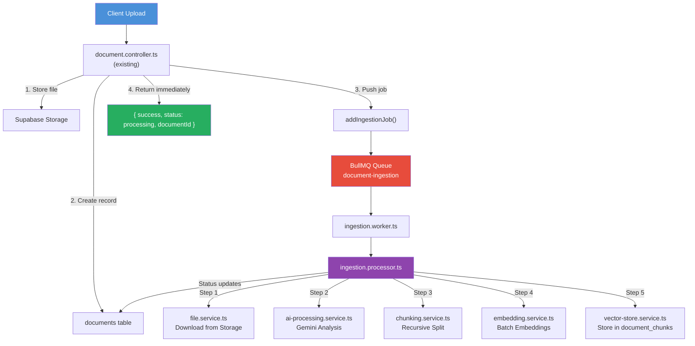

# Document Ingestion Pipeline — Implementation Report

## 📁 New File Tree

```
q-ai-main/
├── backend/src/
│   ├── types/
│   │   └── ingestion.types.ts          # All type definitions + queue config constants
│   ├── services/
│   │   ├── file.service.ts             # Supabase Storage download + file type detection
│   │   ├── ai-processing.service.ts    # Gemini multimodal analysis (image/doc/video/text)
│   │   ├── chunking.service.ts         # Recursive text chunking (1000 chars, 200 overlap)
│   │   ├── embedding.service.ts        # Gemini batch embeddings (gemini-embedding-001)
│   │   └── vector-store.service.ts     # Supabase document_chunks batch insertion
│   └── queue/
│       ├── queue.ts                    # BullMQ queue instance + addIngestionJob()
│       ├── ingestion.processor.ts      # Pipeline orchestrator (5 services wired together)
│       └── ingestion.worker.ts         # BullMQ Worker (standalone or embedded)
├── src/utils/
│   ├── file.utils.ts                   # Extension parsing + MIME classification
│   └── metadata.utils.ts              # ChunkMetadata construction helpers
```

**Total: 10 new files, 0 files modified.**

---

## 🏗️ Architecture Diagram



---

## ⚙️ How It Works

### Flow

| Step | Component | Action |
|------|-----------|--------|
| 1 | `document.controller.ts` (existing) | Stores file, creates DB record, **pushes to queue** |
| 2 | `queue.ts` | Routes job to BullMQ with retry config |
| 3 | `ingestion.worker.ts` | Picks up job, delegates to processor |
| 4 | `file.service.ts` | Downloads file from Supabase Storage |
| 5 | `ai-processing.service.ts` | Routes to `analyzeImage/Document/Video` based on file type |
| 6 | `chunking.service.ts` | Recursive splitting (1000 chars, 200 overlap) |
| 7 | `embedding.service.ts` | Batch embedding via `gemini-embedding-001` |
| 8 | `vector-store.service.ts` | Inserts into `document_chunks` via Supabase REST |
| 9 | `ingestion.processor.ts` | Updates `documents.processing_status` → `completed` or `failed` |

### File Type Routing

| Extension | Category | Gemini Strategy |
|-----------|----------|-----------------|
| `png, jpg, jpeg, webp` | image | Multimodal `inline_data` (base64) |
| `pdf` | document | Multimodal `inline_data` (base64) |
| `mp4` | video | File API upload → `file_data` reference |
| `docx, xlsx` | text | Multimodal `inline_data` (base64) |

### Queue Configuration

| Setting | Value |
|---------|-------|
| Queue name | `document-ingestion` |
| Concurrency | 5 |
| Max retries | 3 |
| Backoff | Exponential (2s → 4s → 8s) |
| Stalled detection | 5 minutes |
| Job lock duration | 10 minutes |

---

## 🔌 Integration Point

To connect the pipeline to the existing controller, add this call inside `addDocument()` in `document.controller.ts` (or in the vault router that calls it):

```typescript
import { addIngestionJob } from '../../backend/src/queue/queue';

// After creating the document record:
const doc = await ORM.Document.create({ ... });

// Push async processing job
await addIngestionJob({
  documentId: doc.id,
  vaultId: input.vaultId,
  userId: vault.userId,   // Resolved from the vault
  filename: input.filename,
  filePath: `vault/${input.vaultId}/${input.filename}`,
  mimeType: input.mimeType,
  courseVault: input.courseVault,
});

// Return immediately
return { success: true, status: "processing", documentId: doc.id };
```

> [!WARNING]
> This integration snippet requires modifying `document.controller.ts`. Per the hard constraints, **you should do this yourself** when ready. The pipeline is fully functional once this call is wired in.

---

## 📦 Required Dependencies

Install these packages (they are NOT in the existing package.json):

```bash
cd src
npm install bullmq ioredis
```

And add `REDIS_URL` to your `.env`:

```env
# ── Redis (BullMQ) ──────────────────────────────────────────────────────────
REDIS_URL=redis://127.0.0.1:6379
```

> [!IMPORTANT]
> Redis must be running locally or accessible via `REDIS_URL`. For local development, install Redis via WSL or use a Docker container: `docker run -d --name redis -p 6379:6379 redis:7-alpine`

---

## 🚀 Running the Worker

### Option A: Standalone Process (Recommended for Production)

```bash
npx tsx backend/src/queue/ingestion.worker.ts
```

### Option B: Embedded in API Server

```typescript
import { startIngestionWorker } from './backend/src/queue/ingestion.worker';
startIngestionWorker();  // Non-blocking, runs alongside Express
```

---

## 🛡️ Error Handling & Resilience

| Scenario | Handling |
|----------|----------|
| Job fails | BullMQ retries up to 3× with exponential backoff |
| Retry on partially processed doc | Existing chunks are **purged** before re-processing (idempotent) |
| AI returns empty text | Document marked `completed` with 0 chunks (no error) |
| Single batch embed fails | Falls back to individual embedding per chunk |
| Single vector insert fails | Falls back to individual row inserts |
| All retries exhausted | `documents.processing_status = "failed"`, error stored in `processing_error` |

---

## 📡 Frontend Polling Support

The API already supports status polling via `getDocumentById()`. The frontend can poll:

```typescript
// Poll document status
const doc = await trpc.document.getById.query({ id: documentId });
// doc.processingStatus → "pending" | "processing" | "completed" | "failed"
// doc.processingError  → error message if failed
```

The architecture is also websocket-upgrade ready — a future `QueueEvents` listener can push real-time status updates.
